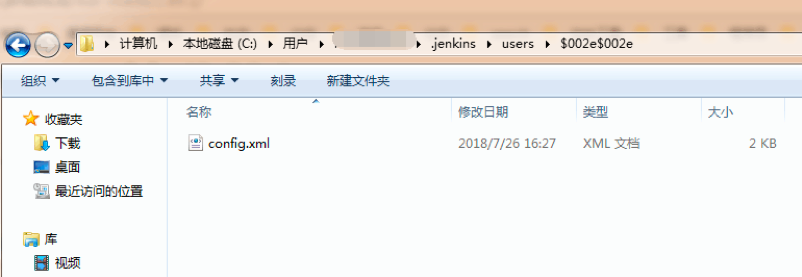

### 一 CVE-2018-1999001
Jenkins 配置文件路径改动导致管理员权限开放

### 二 漏洞描述
Jenkins 2.132 及更早版本、2.121.1 及更早版本 User.java 中存在一个未经授权的配置修改漏洞，允许攻击者提供精心设计的登录凭据，导致 Jenkins 将 config.xml 文件从 Jenkins 主目录移动。如果 Jenkins 在没有此文件的情况下启动，它将恢复为向匿名用户授予管理员访问权限的传统默认设置。

### 三 漏洞利用
一个未授权用户访问漏洞Jenkins版本的任意页面时,如果http header中加入了Authorization基础认证头，并且基础认证头中的用户名为”..”，就会触发该漏洞。

等待服务重启，可用CVE-2018-1999043打崩溃服务，等待管理员重启

漏洞利用没法一步到位，需要管理员重启，poc比较困难，利用难度不小

### 四 修复方式
Jenkins weekly 升级到 2.133 版本  
Jenkins LTS 升级到 2.121.2 版本

> 参考链接
> https://anquan.baidu.com/article/190
> https://xz.aliyun.com/t/3652
